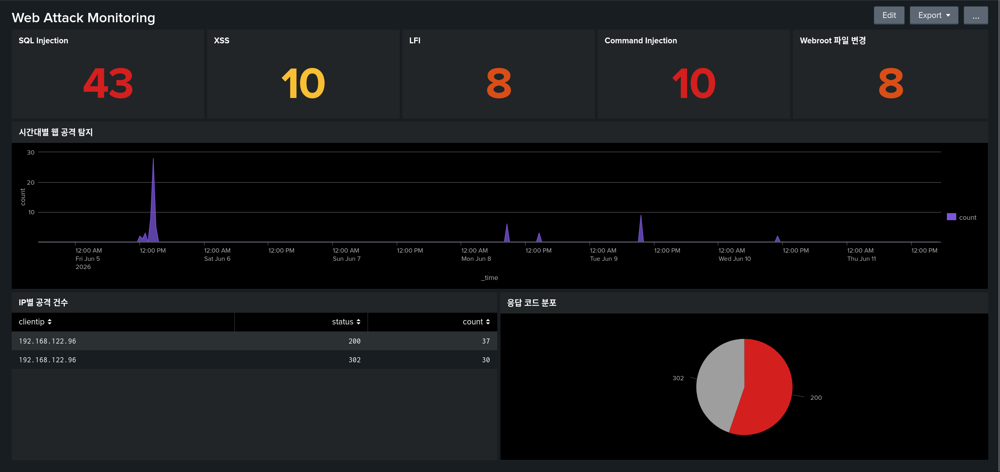

# Web Attack Detection Lab

DVWA와 Splunk를 활용한 웹 공격 탐지 Lab입니다.

## Project Overview

이 프로젝트는 DVWA를 대상으로 SQL Injection, XSS, LFI, Command Injection, 웹쉘 업로드 공격을 수행하고 Apache 접근 로그와 Linux auditd 로그를 Splunk로 수집해 탐지하는 보안관제 실습 프로젝트입니다.

## Lab Environment

- Host OS : Arch Linux
- Virtualization : KVM/QEMU
- SIEM : Splunk Enterprise
- Target : DVWA (Debian 13, Apache 2.4.67) - 192.168.122.20
- Log Sources : Apache access log (access_combined), Linux auditd (linux_audit)
- Attacker VM : Kali Linux - 192.168.122.96

## Detection Scenarios

1. SQL Injection 탐지
2. Reflected XSS 탐지
3. LFI 탐지
4. Command Injection 탐지
5. Web shell 업로드 탐지

## Dashboard Screenshots

### Web Attack Monitoring



## Repository Structure

```
web-attack-detection-lab
├── docs
│   ├── 00_pipeline_check.md
│   ├── 01_sqli.md
│   ├── 02_xss.md
│   ├── 03_lfi.md
│   ├── 04_command_injection.md
│   └── 05_upload_webshell.md
├── README.md
├── screenshots
└── tickets
    ├── TICKET-01-sqli.md
    ├── TICKET-02-xss.md
    ├── TICKET-03-lfi.md
    ├── TICKET-04-command-injection.md
    └── TICKET-05-upload-webshell.md
```

