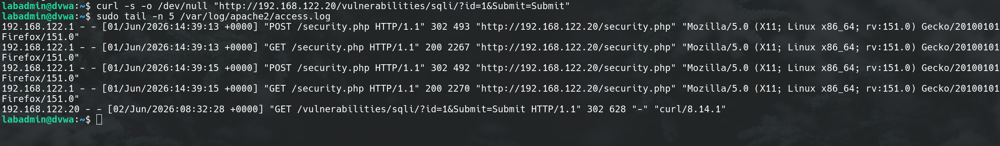
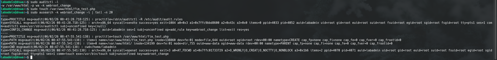
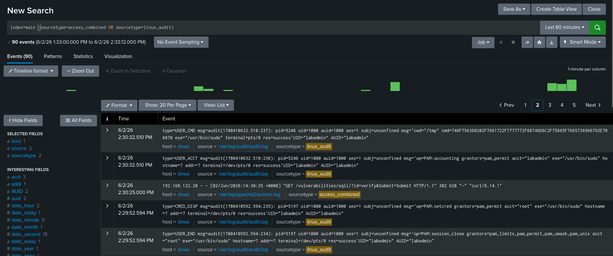
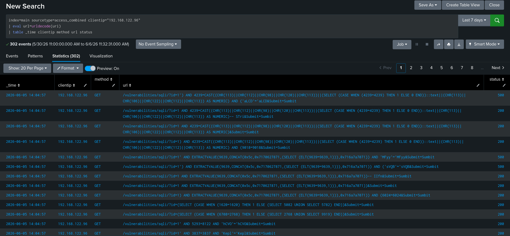

# Pipeline Check

## 개요

탐지 쿼리 작성 전에  access_combined와 linux_audit 두 sourcetype이 Splunk의 main 인덱스로 정상 수집되는지와 인코딩된 URL이 urldecode로 풀리는지 확인하는 점검용 검색이다.

## 사용 로그

- Apache access log (access_combined)
- Linux auditd (linux_audit)

## 원본 로그 확인

Splunk로 보내기 전에 DVWA 호스트에서 두 로그 소스가 실제로 기록되는지 먼저 확인한다. Apache 접근 로그는 `/var/log/apache2/access.log`에 쌓인다.



auditd는 웹 루트(`/var/www/html`)에 `-k webroot_change` 감시 룰을 걸어 파일 변경 이벤트를 기록한다.



## SPL 쿼리

```spl
index=main (sourcetype=access_combined OR sourcetype=linux_audit)
```

두 sourcetype이 모두 main 인덱스로 들어오는지 확인한다. Universal Forwarder가 정상 동작하면 Apache 접근 로그와 auditd 로그가 함께 조회된다.


```spl
index=main sourcetype=access_combined clientip="192.168.122.96"
| eval url=urldecode(uri)
| table _time clientip method url status
```

uri가 %2F, %3B처럼 인코딩되어 들어오기 때문에 urldecode로 풀어서 사람이 읽을 수 있는 형태로 보이는지 확인한다.

## 점검 결과

두 sourcetype이 main 인덱스로 함께 수집되는 것을 확인했다. 최근 60분 기준 access_combined와 linux_audit 이벤트 90건이 dvwa 호스트에서 조회된다.



urldecode로 인코딩된 uri가 사람이 읽을 수 있는 공격 문자열로 정상 디코딩되는 것도 확인했다.


