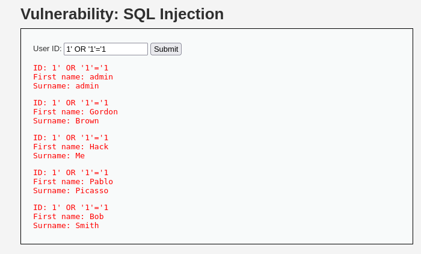
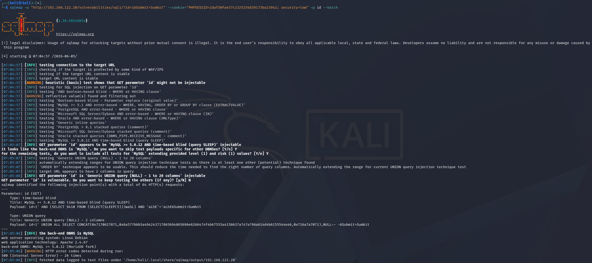
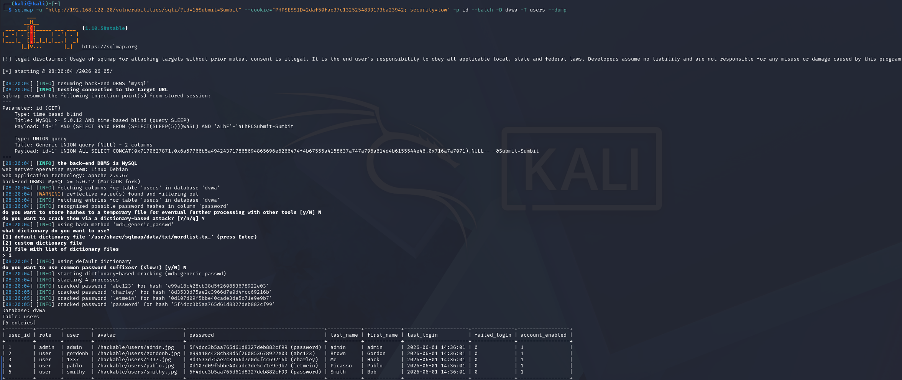

# SQL Injection Detection

## 개요

DVWA 웹 서버의 접근 로그에서 union select, information_schema, sleep() 등 SQL Injection 시그니처가 포함된 요청을 탐지한다.

## 사용 로그

- Apache access log (access_combined)

## MITRE ATT&CK

- Tactic : Initial Access
- Technique : Exploit Public-Facing Application - T1190

## 시나리오

Kali Linux에서 브라우저와 sqlmap을 사용하여 DVWA의 SQL Injection 페이지(/vulnerabilities/sqli/)를 공격했다.
'를 입력해 주입 지점을 확인한 뒤 1' OR '1'='1로 전체 사용자를 조회하고 sqlmap으로 dvwa.users 테이블의 계정 해시를 덤프했다.








## SPL 쿼리

```spl
index=main sourcetype=access_combined host=dvwa
    uri_query="*union*select*"
    OR uri_query="*union+select*"
    OR uri_query="*1=1*"
    OR uri_query="*information_schema*"
    OR uri_query="*sleep(*"
| eval decoded=urldecode(uri_query)
| table _time clientip method uri_path decoded status
| sort -_time
```

main 인덱스의 access_combined 로그에서 host가 dvwa인 요청을 검색한다.
그중 uri_query에 union select, 1=1, information_schema, sleep( 같은 SQL Injection 시그니처가 포함된 요청만 필터링한다.
이후 urldecode로 인코딩된 페이로드를 디코딩하고, 시간, 출발지 IP, 메서드, 경로, 디코딩된 페이로드, 응답코드를 표로 출력한다.

## 탐지 결과


`192.168.122.96` 에서 `/vulnerabilities/sqli/` 경로로 SQL Injection 요청 43건이 탐지되었다. 디코딩된 페이로드에서 `CONCAT(0x...)` 형태의 sqlmap 특유 패턴이 확인되었다.
