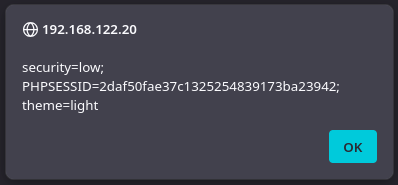
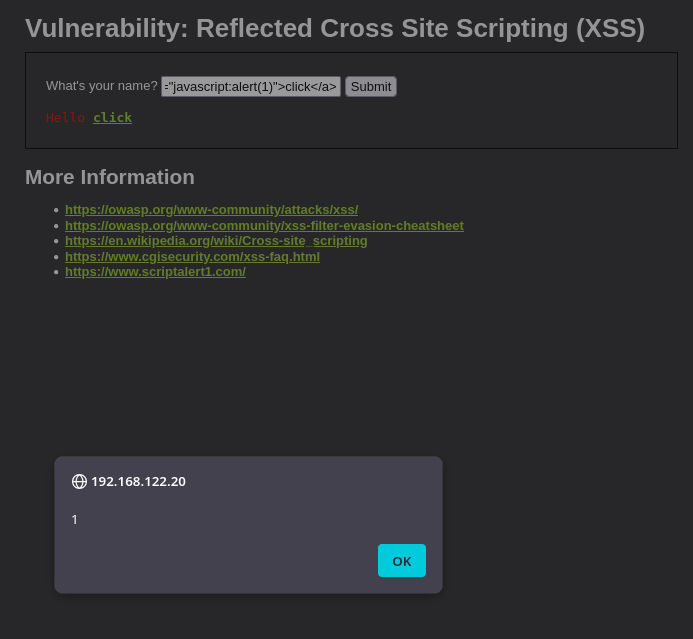

# XSS Detection

## 개요

접근 로그에서 script 태그, onerror, onload, javascript, document.cookie 등 XSS 페이로드가 포함된 요청을 탐지한다.

## 사용 로그

- Apache access log (access_combined)

## MITRE ATT&CK

- Tactic : Initial Access
- Technique : Exploit Public-Facing Application - T1190

## 시나리오

Kali Linux에서 DVWA의 Reflected XSS 페이지(`/vulnerabilities/xss_r/`)에 `<script>alert(1)</script>`, `<svg onload=alert(1)>`, ``, `javascript:` 링크 등을 입력해 스크립트 실행을 확인했다.
`document.cookie`를 출력하는 페이로드도 입력해 alert 창에 세션 쿠키가 노출되는 것을 확인했다.






## SPL 쿼리

```spl
index=main sourcetype=access_combined host=dvwa
    (uri_query="*<script*"
    OR uri_query="*%3Cscript*"
    OR uri_query="*onerror*"
    OR uri_query="*onload*"
    OR uri_query="*javascript*"
    OR uri_query="*document.cookie*")
| eval decoded=urldecode(uri_query)
| table _time clientip method uri_path decoded status
| sort -_time
```

main 인덱스의 access_combined 로그에서 `uri_query`에 `<script`, `onerror`, `onload`, `javascript`, `document.cookie` 같은 XSS 시그니처가 포함된 요청을 필터링한다. `<script`는 인코딩된 `%3Cscript` 형태도 함께 본다.

이후 urldecode로 페이로드를 디코딩하고, 시간, 출발지 IP, 메서드, 경로, 디코딩된 페이로드, 응답코드를 표로 출력한다.

## 탐지 결과


`192.168.122.96` 에서 `/vulnerabilities/xss_r/` 경로로 XSS 페이로드가 포함된 요청 9건이 탐지되었다.
디코딩된 페이로드에서 script 태그와 onerror, onload 핸들러가 확인되었다.
