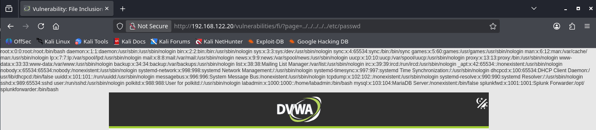
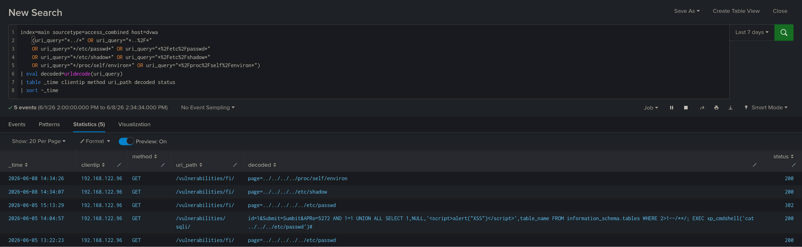

# LFI Detection

## 개요

접근 로그에서 `../` 경로 순회 패턴이나 `/etc/passwd`, `/etc/shadow`, `/proc/self/environ` 같은 민감 파일 경로가 포함된 요청을 탐지한다.

## 사용 로그

- Apache access log (access_combined)

## MITRE ATT&CK

- Tactic : Initial Access
- Technique : Exploit Public-Facing Application - T1190

## 시나리오

Kali Linux에서 DVWA의 File Inclusion 페이지(/vulnerabilities/fi/)의 page 파라미터에 `../../../../../etc/passwd`를 입력해 `/etc/passwd` 파일을 읽었다.



## SPL 쿼리

```spl
index=main sourcetype=access_combined host=dvwa
    (uri_query="*../*" OR uri_query="*..%2F*"
    OR uri_query="*/etc/passwd*" OR uri_query="*%2Fetc%2Fpasswd*"
    OR uri_query="*/etc/shadow*" OR uri_query="*%2Fetc%2Fshadow*"
    OR uri_query="*/proc/self/environ*" OR uri_query="*%2Fproc%2Fself%2Fenviron*")
| eval decoded=urldecode(uri_query)
| table _time clientip method uri_path decoded status
| sort -_time
```

main 인덱스의 access_combined 로그에서 uri_query에 `../`, `/etc/passwd`, `/etc/shadow`, `/proc/self/environ` 같은 민감 경로가 포함된 요청을 필터링한다. URL 인코딩된 형태(..%2F, %2Fetc%2Fpasswd)도 함께 검색한다.
이후 urldecode로 페이로드를 디코딩하고, 시간, 출발지 IP, 메서드, 경로, 디코딩된 페이로드, 응답코드를 표로 출력한다.

## 탐지 결과



`192.168.122.96` 에서 `/vulnerabilities/fi/` 경로로 요청 5건이 탐지되었다. 디코딩된 페이로드에서 `../../../../etc/passwd`, `../../../../proc/self/environ` 등 lfi 공격 형태가 확인되었다.