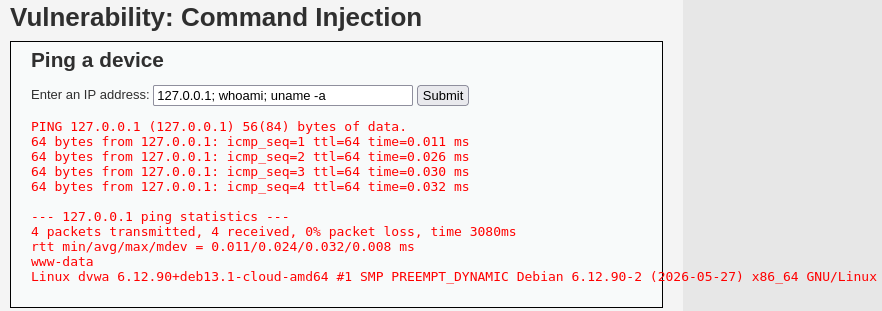
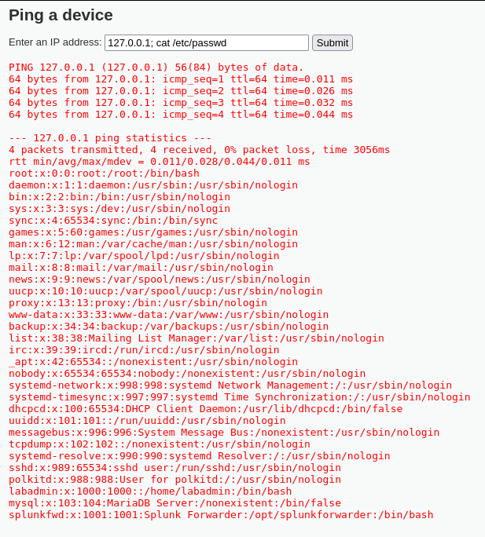
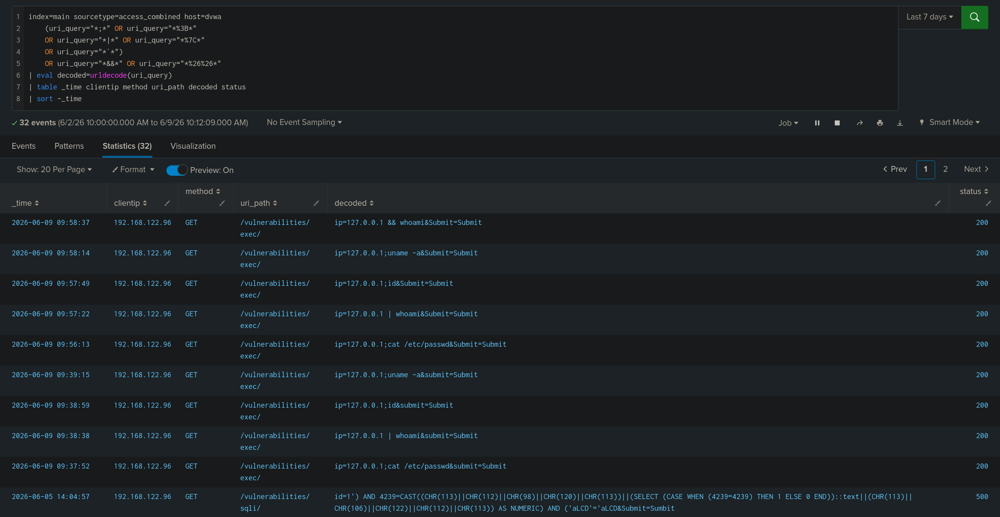
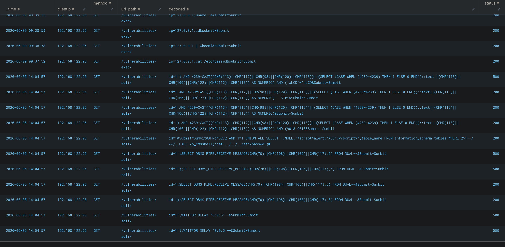
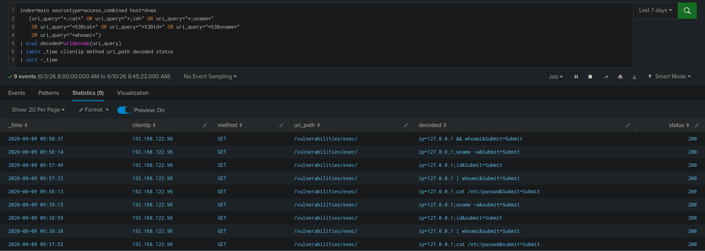
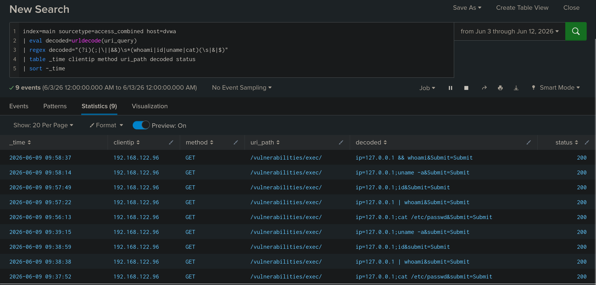

# Command Injection Detection

## 개요

접근 로그에서 셸 메타문자와 함께 whoami, id, uname, cat 같은 명령어가 포함된 요청을 탐지한다.
처음에는 셸 메타문자만으로 탐지했으나 오탐이 많아 명령어까지 함께 보는 방식으로 정밀화했다.

## 사용 로그

- Apache access log (access_combined)

## MITRE ATT&CK

- Tactic : Execution
- Technique : Command and Scripting Interpreter - T1059

## 시나리오

Kali Linux에서 DVWA의 Command Injection 페이지(/vulnerabilities/exec/)의 IP 입력란에 `127.0.0.1; id`, `127.0.0.1 && whoami`, `127.0.0.1; uname -a`, `127.0.0.1; cat /etc/passwd`처럼 셸 메타문자로 명령을 연결해 입력했다. www-data 권한으로 명령이 실행되는 것을 확인했다.





## SPL 쿼리

처음에는 셸 메타문자(; | &&)만으로 필터링했다.

```spl
index=main sourcetype=access_combined host=dvwa
    (uri_query="*;*" OR uri_query="*%3B*"
    OR uri_query="*|*" OR uri_query="*%7C*"
    OR uri_query="*&&*" OR uri_query="*%26%26*")
| eval decoded=urldecode(uri_query)
| table _time clientip method uri_path decoded status
| sort -_time
```




이 경우 32건이 탐지되었는데 명령어 주입이 아닌 SQL Injection 요청처럼 메타문자만 포함된 다른 요청까지 함께 매칭되어 오탐이 섞였다.
그래서 메타문자에 실제 명령어(whoami, id, uname, cat)를 함께 보도록 조건을 좁혔다.

```spl
index=main sourcetype=access_combined host=dvwa
    (uri_query="*;cat*" OR uri_query="*;id*" OR uri_query="*;uname*"
     OR uri_query="*%3Bcat*" OR uri_query="*%3Bid*" OR uri_query="*%3Buname*"
     OR uri_query="*whoami*")
| eval decoded=urldecode(uri_query)
| table _time clientip method uri_path decoded status
| sort -_time
```


이렇게 하니 9건으로 줄었다. 마지막으로 긴 OR 나열 대신 regex로 메타문자 뒤에 명령어가 오는 패턴을 한 줄로 정리했다.

```spl
index=main sourcetype=access_combined host=dvwa
| eval decoded=urldecode(uri_query)
| regex decoded="(?i)(;|\||&&)\s*(whoami|id|uname|cat)(\s|&|$)"
| table _time clientip method uri_path decoded status
| sort -_time
```


regex로 바꾼 뒤에도 탐지 건수는 9건으로 동일했고 룰만 단순해졌다.

## 탐지 결과


`192.168.122.96` 에서 `/vulnerabilities/exec/` 경로로 명령어 주입 요청 9건이 탐지되었다. 디코딩된 페이로드에서 `;whoami`, `;id`, `;cat /etc/passwd` 등이 확인되었다.
