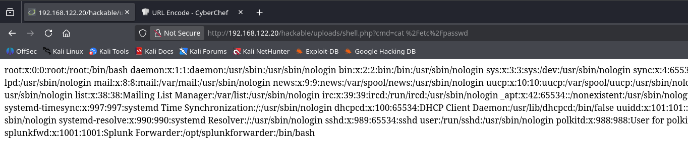
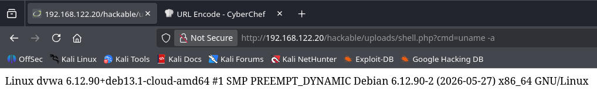

# Web Shell Upload Detection

## 개요

파일 업로드 요청은 `POST`로 전송되기 때문에 Apache 접근 로그만으로는 업로드된 파일 내용이나 파일명을 직접 확인하기 어렵다.  
따라서 `access_combined`의 업로드 요청과 `linux_audit`의 웹 루트 파일 생성 이벤트를 시간순으로 묶어 웹쉘 업로드 흐름을 확인한다.

## 사용 로그

- Apache access log (access_combined)
- Linux auditd - webroot change

## MITRE ATT&CK

- Tactic : Persistence
- Technique : Server Software Component: Web Shell - T1505.003
- Tactic: Execution
- Technique: Command and Scripting Interpreter - T1059

## 시나리오

Kali Linux에서 DVWA의 파일 업로드 기능(`/vulnerabilities/upload/`)으로 PHP 웹쉘 파일을 업로드했다. 
이후 업로드된 `hackable/uploads/shell.php`에 `?cmd=` 파라미터로 명령을 전달해 `cat /etc/passwd`, `uname -a` 등을 실행했다.






## SPL 쿼리

웹 루트(/var/www/html)에 auditd 감시 룰(-k webroot_change)을 걸어 파일 생성 이벤트를 수집했다.


```spl
index=main sourcetype=linux_audit host=dvwa webroot_change
| sort -_time
```

이후 업로드 요청과 파일 생성을 한 테이블에 합쳐 시간순으로 정렬했다.

```spl
index=main host=dvwa
    ((sourcetype=access_combined clientip="192.168.122.96" uri_path="*upload*")
    OR (sourcetype=linux_audit webroot_change))
| table _time sourcetype clientip method uri_path status comm syscall
| sort _time
```

access_combined의 업로드 요청과 linux_audit의 파일 생성 이벤트(apache2 프로세스)를 한 화면에서 시간순으로 보면서, 업로드 직후 webroot에 파일이 생성되는 흐름을 확인한다.

## 탐지 결과


`192.168.122.96` 의 업로드 요청 직후 webroot에 파일이 생성되는 흐름이 상관분석으로 확인되었다. 이후 업로드된 `shell.php`에 cmd 파라미터로 명령이 실행된 흔적도 확인되었다.
