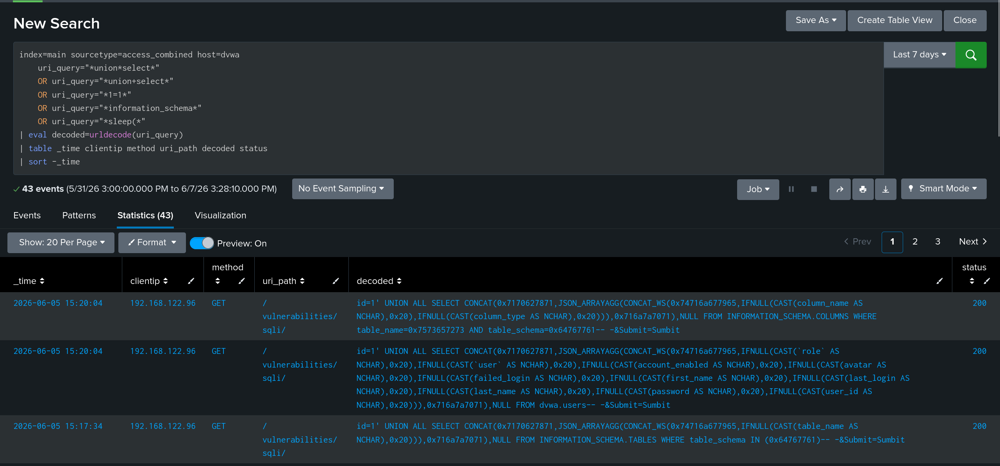
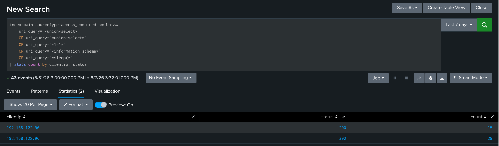

# TICKET-01 SQL Injection

## 탐지 개요

- 발생 날짜 : 2026-06-05 14:53~15:20
- 출발지 IP : 192.168.122.96
- 대상 : 192.168.122.20
- 심각도 : High
- 탐지 룰 : docs/01_sqli.md
- MITRE ATT&CK : Exploit Public-Facing Application - T1190

## 분석

접근 로그에서 union select, information_schema, sleep() 시그니처가 포함된 요청 43건이 탐지되었다. 모두 192.168.122.96에서 발생했고 응답코드는 200과 302이다.
디코딩된 페이로드에 `CONCAT(0x...)` 형태의 인코딩이 보여 sqlmap을 사용한 것으로 판단된다.

## 판단

정탐으로 판단했다. 단일 공격자 IP에서 자동화 도구와 수동 공격이 함께 식별되었다.

## 조치

- 출발지 192.168.122.96 차단
- id 파라미터 입력값 검증
- 해시 유출을 가정해 DB 계정 비밀번호 재설정

## 근거 화면

### SQL Injection 탐지 결과

### 공격자 IP 기준 집계

