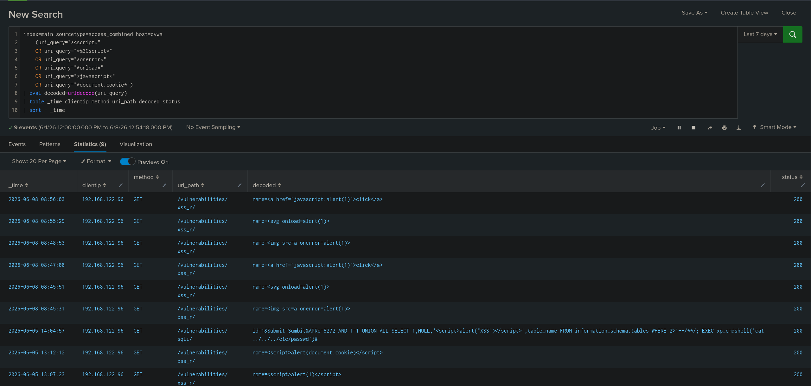
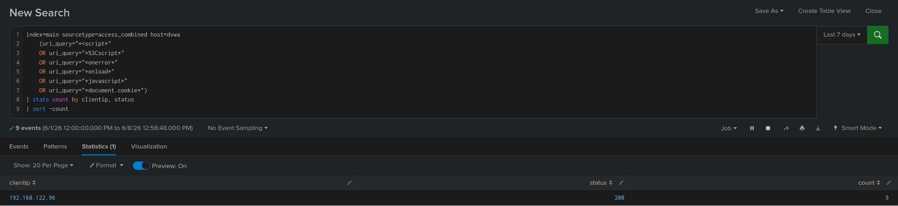

# TICKET-02 Reflected XSS

## 탐지 개요

- 발생 날짜 : 2026-06-08 08:45~08:56, 2026-06-05 13:07~13:12
- 출발지 IP : 192.168.122.96
- 대상 : 192.168.122.20
- 심각도 : High
- 탐지 룰 : docs/02_xss.md
- 분류 : OWASP XSS / CWE-79

## 분석

접근 로그에서 `/vulnerabilities/xss_r/` 경로로 ``, ``, ``, `<svg onload=alert(1)>`, `javascript:alert(1)` 등 Reflected XSS 공격에 사용되는 패턴이 확인되었다.

## 판단

정탐으로 판단했다.
Apache 접근 로그에서 `<script>`, `onerror`, `onload`, `javascript:`, `document.cookie` 등 XSS 공격에 사용되는 문자열이 확인되었고 동일한 출발지 IP에서 `/vulnerabilities/xss_r/` 경로로 반복 요청이 발생했다.

## 조치

- 출력 시 입력값 HTML 인코딩 처리
- 세션 쿠키에 HttpOnly, Secure 속성 적용 (현재 미적용 상태)

## 근거 화면

### XSS 탐지 결과

### 공격자 IP 기준 집계

