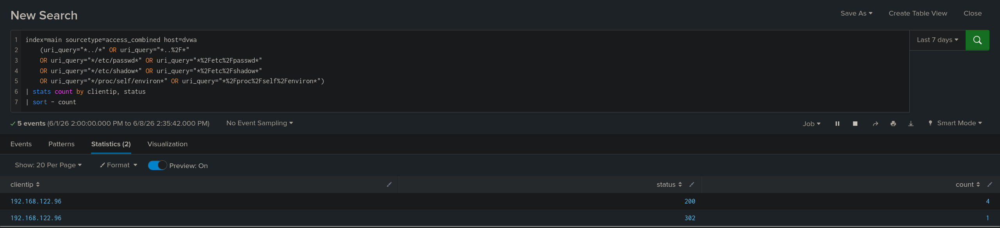

# TICKET-03 LFI

## 탐지 개요

- 발생 시각 : 2026-06-08 14:34
- 출발지 IP : 192.168.122.96
- 대상 : 192.168.122.20
- 심각도 : High
- 탐지 룰 : docs/03_lfi.md
- MITRE ATT&CK : Exploit Public-Facing Application - T1190

## 분석

접근 로그에서 ../, /etc/passwd, /etc/shadow, /proc/self/environ 등 LFI 및 Path Traversal 시그니처가 포함된 요청 4건이 탐지되었다. 탐지된 요청은 모두 192.168.122.96에서 발생했으며 대상 경로는 /vulnerabilities/fi/이다.

디코딩된 페이로드에서는 page=../../../../etc/passwd, page=../../../../etc/shadow, page=../../../../proc/self/environ 등 웹 루트 외부의 시스템 파일을 읽으려는 패턴이 확인되었다. /etc/passwd, /etc/shadow, /proc/self/environ처럼 민감한 파일을 직접 지정한 점에서 LFI 공격으로 판단된다.

## 판단

정탐으로 판단했다.
Apache 접근 로그에서 ../, /etc/passwd, /etc/shadow, /proc/self/environ 등 LFI 공격에 사용되는 문자열이 확인되었고 동일한 출발지 IP에서 /vulnerabilities/fi/ 경로로 반복 요청이 발생했다.

## 조치

- page 파라미터 화이트리스트 검증
- ../ 디렉터리 이동 문자열 차단

## 근거 화면

### LFI 탐지 결과

### 공격자 IP 기준 집계

