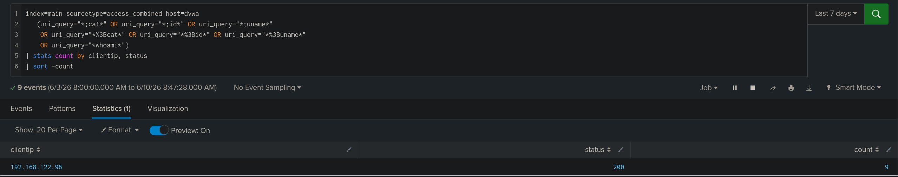

# TICKET-04 Command Injection

## 탐지 개요

- 발생 시각 : 2026-06-09 09:37 ~ 09:58
- 출발지 IP : 192.168.122.96
- 대상 : 192.168.122.20
- 심각도 : High
- 탐지 룰 : docs/04_command_injection.md
- MITRE ATT&CK : Command and Scripting Interpreter - T1059

## 분석

접근 로그에서 `;`, `|`, `&&` 등 명령 연결 문자와 `whoami`, `id`, `uname`, `cat` 등 OS 명령어가 포함된 요청 9건이 탐지되었다. 탐지된 요청은 모두 `192.168.122.96`에서 발생했으며 대상 경로는 `/vulnerabilities/exec/`이다.

디코딩된 페이로드에서는 `ip=127.0.0.1;cat /etc/passwd`, `ip=127.0.0.1 | whoami`, `ip=127.0.0.1;id`, `ip=127.0.0.1;uname -a`, `ip=127.0.0.1 && whoami` 등 정상 ping 입력 뒤에 OS 명령을 실행한 것이 확인됐다.

## 판단

정탐으로 판단했다.
Apache 접근 로그에서 `;`, `|`, `&&` 등 명령 연결 문자와 `whoami`, `id`, `uname`, `cat` 등 Command Injection 공격에 사용되는 문자열이 확인되었고 동일한 출발지 IP에서 `/vulnerabilities/exec/` 경로로 반복 요청이 발생했다.

## 조치

- 출발지 192.168.122.96 차단
- IP 입력값에 셸 메타문자(; | && 등) 필터링

## 근거 화면

### Command Injection 탐지 결과

### 공격자 IP 기준 집계

