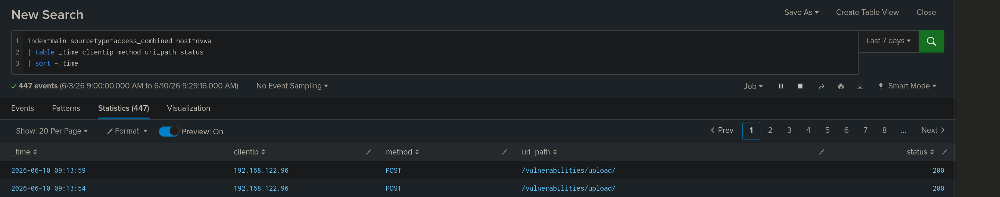
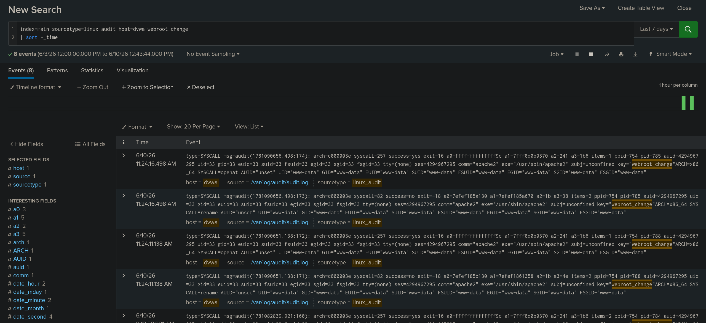
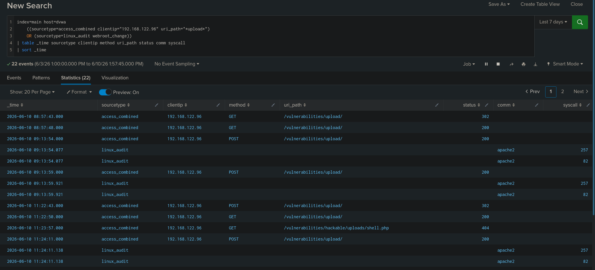

# TICKET-05 파일 업로드 웹쉘

## 탐지 개요

- 발생 시각 : 2026-06-10 11:22 ~ 11:32
- 출발지 IP : 192.168.122.96
- 대상 : 192.168.122.20
- 심각도 : High
- 탐지 룰 : docs/05_upload_webshell.md
- MITRE ATT&CK : Server Software Component: Web Shell - T1505.003

## 분석

접근 로그에서 `/vulnerabilities/upload/` 경로로 웹쉘 업로드로 의심되는 `POST` 요청이 확인되었다. 이후 `linux_audit` 로그에서 `webroot_change` 이벤트가 발생했으며 `apache2` 프로세스가 `www-data` 권한으로 웹 루트 내 파일 생성 및 변경 작업을 수행한 정황이 확인되었다.

상관분석 결과 동일한 출발지 IP `192.168.122.96`에서 업로드 요청 이후 `/hackable/uploads/shell.php` 경로로 접근한 기록이 확인되었다. 이후 `cmd=id`, `cmd=whoami`, `cmd=cat /etc/passwd`, `cmd=uname -a` 등 웹쉘을 통해 OS 명령 실행을 시도한 요청이 발생했고 응답코드는 200으로 확인되었다.

업로드 요청과 웹 루트 파일 변경 이벤트 그리고 `shell.php` 실행 요청이 시간 순서상 연결되어 있어 단순 파일 업로드가 아니라 웹쉘 업로드 및 실행 시도로 판단된다.

## 판단

정탐으로 판단했다.
동일한 출발지 IP에서 파일 업로드 요청 이후 웹 루트 파일 변경 이벤트와 `shell.php` 접근이 확인되었다. 이후 `cmd` 파라미터를 통한 명령 실행 요청이 이어져 웹쉘 업로드 및 실행 시도로 판단했다.

## 조치

- 업로드된 hackable/uploads/shell.php 삭제
- 업로드 파일 확장자 화이트리스트 적용

## 근거 화면

### 업로드 요청 로그

### 웹 루트 파일 생성 이벤트

### 업로드 및 웹쉘 실행 상관분석 결과

